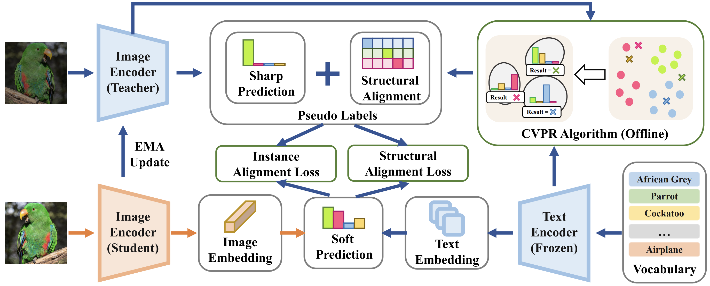
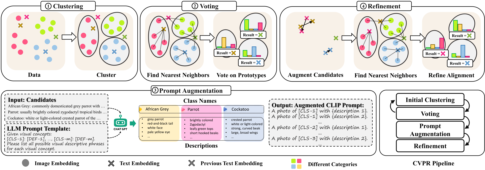

# S3A: Towards Realistic Zero-Shot Classification via Self Structural Semantic Alignment

> [S3A: Towards Realistic Zero-Shot Classification via Self Structural Semantic Alignment](https://arxiv.org/abs/2308.12960)
>
> [Sheng Zhang](https://sheng-eatamath.github.io/), [Muzammal Naseer](https://muzammal-naseer.netlify.app/), [Guangyi Chen](https://chengy12.github.io/), [Zhiqiang Shen](https://zhiqiangshen.com/), [Salman Khan](https://salman-h-khan.github.io/), [Kun Zhang](https://www.andrew.cmu.edu/user/kunz1/), [Fahad Khan](https://sites.google.com/view/fahadkhans/home)

This is official repo for our paper: [S3A: Towards Realistic Zero-Shot Classification via Self Structural Semantic Alignment](https://arxiv.org/abs/2308.12960).

### Abstract

> *Large-scale pre-trained Vision Language Models (VLMs) have proven effective for zero-shot classification. Despite the success, most traditional VLMs-based methods are restricted by the assumption of partial source supervision or ideal vocabularies, which rarely satisfy the open-world scenario. In this paper, we aim at a more challenging setting, **Realistic Zero-Shot Classification**, which assumes no annotation but instead a broad vocabulary. To address this challenge, we propose the **Self Structural Semantic Alignment (S^3A)** framework, which extracts the structural semantic information from unlabeled data while simultaneously self-learning. Our S^3A framework adopts a unique Cluster-Vote-Prompt-Realign (CVPR) algorithm, which iteratively groups unlabeled data to derive structural semantics for pseudo-supervision. Our CVPR process includes iterative clustering on images, voting within each cluster to identify initial class candidates from the vocabulary, generating discriminative prompts with large language models to discern confusing candidates, and realigning images and the vocabulary as structural semantic alignment. Finally, we propose to self-learn the CLIP image encoder with both individual and structural semantic alignment through a teacher-student learning strategy. Our comprehensive experiments across various generic and fine-grained benchmarks demonstrate that the S^3A method offers substantial improvements over existing VLMs-based approaches, achieving a **more than 15% accuracy improvement** over CLIP on average.*




### Highlights




We propose a Self Structural Semantic Alignment ($S^3A$) framework, to address the challenging Realistic Zero-Shot Classification problem, which jointly extracts and self-learns on the individual and structural semantic alignment. 

We propose a **Cluster-Vote-Prompt-Realign (CVPR)** algorithm to reliably derive reliable structural semantic alignments between images and the large vocabulary. **Clustering** unearths inherent grouping structures within image embeddings, producing meaningful image semantics. **Voting** associates each cluster with initial category candidates, representing potential pseudo-alignments. These two steps can be executed iteratively to obtain more reliable candidates. **Prompting** leverages the power of large language models (LLMs) to discern nuanced candidates by augmenting prompts with discriminative attributes. **Re-alignment** represents calibrating the cluster-vocabulary alignment with LLM-augmented prompts as pseudo structural semantic alignment labels. 


### Installation and Setup

All the incorporated datasets are prepared under the `{HOME}/dataset` directory, and `config.py` contains global path information.

Change global file paths in `config.py` , and dataset paths in `data/imagenet_datasets.py` if necessary.

For environment setup, please follow the below instructions:

```
conda create -n sssa python=3.8
conda activate sssa
conda install pytorch==1.10.1 torchvision==0.11.2 torchaudio==0.10.1 cudatoolkit=11.3 -c pytorch -c conda-forge -y
conda install scipy -y
conda upgrade torchvision
pip install requirements.txt

### install dependent packages
cd ./robustness
pip install -v -e .

### add notebook environment
python -m ipykernel install --user --name sssa
jupyter kernelspec list
nohup jupyter lab --allow-root >> ~/.jupyter.log 2>&1 &
```


### Models
Download `cache.zip` from [link](https://drive.google.com/drive/folders/1DN9Un1K63Wtxfq92cThQ8S0Q_8XgUbve?usp=sharing) and unzip it at `ipynb/`.
We release here our checkpoints/prompts for evaluations on all benchmarks in our original paper:

| Setting  | Dataset            | Performance (Acc/Clu for RZSC, Acc/Acc for OOV) | Prompt | Model |
| -------- | ------------------ | ----------------------------------------------- | ------ | ----- |
| RZSC     | StanfordDogs       | 58.94/62.19                                     |        |       |
| RZSC     | ImageNet-100       | 52.08/82.76                                     |        |       |
| RZSC     | ImageNet-1K        | 42.43/63.15                                     |        |       |
| RZSC     | BREEDS-Living17    | 48.34/75.57                                     |        |       |
| RZSC     | BREEDS-Nonliving26 | 56.20/75.97                                     |        |       |
| RZSC     | BREEDS-Entity13    | 45.21/76.92                                     |        |       |
| RZSC     | BREEDS-Entity30    | 50.41/76.14                                     |        |       |
| RZSC-OOV | Caltech-101        | 55.29/55.55                                     |        |       |
| RZSC-OOV | CIFAR100           | 46.10/46.40                                     |        |       |
| RZSC-OOV | Oxford-IIIT Pet    | 59.00/60.57                                     |        |       |


### Training

##### Step 1: Computing Structural Semantic Alignment

The preparation includes two three simple steps:

given a target dataset, we simply

1. (Optional, since we provide the files) Run `Build-Vocabulary.ipynb` to build  our vocabulary from all ImageNet (-21K and -1K) classes (synsets listed in file `imagenet21k_wordnet_ids.txt`) based on WordNet synsets (listed in file `wordnet_nouns.pkl`). Since our text classifier is frozen, the extracted classifier is saved at `ipynb/cache/wordnet_classifier.pth` forCLIP `ViT-B/16` and `ipynb/cache/wordnet_classifier_L.pth` for CLIP `ViT-L/14`.
2. (Optional, since we provide the files) Run `Clustering.ipynb` to compute the intial KMeans clusters on CLIP visual features. The resultant clustering will be saved in `ipynb/cache/cluster/`.
3. (Optional, since we provide the files) Run CVPR algorithm with `CVPR-algo.ipynb` and obtain the results saved at `cache/training/cvpr_result-data={args.dataset}-clip(-L).pth`. The results provide the self training with structural and instance semantic alignment. Here, the CVPR algorithm provides the initial semantic structural alignment labels. Therefore, our CVPR algorithm will be executed per-epoch during online training in the step 2.

The specific intructions are introduced in each notebook.

If you do not presume ground-truth cluster number K, then you may need to execute the last step explained below.

##### Step 2: Self-training with Structural and Instance Semantic Alignment

After the structural semantic alignment labels are computed, we conduct self-training with per-epoch structural semantic alignment and per-iteration instance-wise semantic alignment updation.

Here, we provide the training script `train_sssa.sh` to train our $S^3A$ models. This training requires the input of pre-computed results in the step 1.

The detailed hyperparameters are explained below:

```bash
--vocab_name 'in21k' ### vocabulary name, choices=['in21k', 'in21k-L']
--n_iter_cluster_vote 3 ### iteration number of our CVPR algorithm per epoch
--w_ins 1.0  ### weight of instance semantic alignment
--uk 'False' ### whether is unknown K (i.e., the cluster number is unknown), only for LV17, NL26, ET13, ET30
--epoch_init_warmup 2 ### number of epoch using initial structural semantic alignment
--w_str 0.25 ### weight of structural semantic alignment
--oov_dataset 'False' ### True for out-of-vocabulary datasets
--n_sampled_classes 100 ### set 100 for ImageNet-100 dataset
```


##### (Optional) Iterative Cluster Estimation for BREEDS

We can iteratively estimate the cluster number $K$ using the `cluster-estimation/estimate_k_save.sh` script. At each iteration, we specify the lowerbound cluster number with `--min_classes` and upperbound cluster number with `--max_classes`. To alleviate computation overheads, we only conduct cluster estimation by a subset of `--ratio_rand_sample 0.5` percent data points and with at least `--min_rand_sample 30000` data points. 

In our paper, we conduct three iterations in total: (1) estimate between [50, 2000] and get $\hat{K}_1$; (2) estimate betwee [50, $\hat{K}_1$] and get $\hat{K}_2$; (3) estimate between [$\hat{K}_2$, $\frac{\hat{K}_1+\hat{K}_2}{2}$] and get $\hat{K}$.

The estimation is based on extracted CLIP visual features. We provide our pre-extracted files in `ipynb/cache/features/<.npy file>` for the `--vfeatures_fpath` argument. You can also extract your custom features using our `ipynb/Clustering.ipynb` notebook.

The inference script is explained as below:

```bash
### the cluster number is infered with 
python -m a_estimate_k \
--max_classes 476 \ ### specify the upperbound cluster number
--min_classes 50 \ ### specify the lowerbound cluster number
--vfeatures_fpath <PARENT>/ipynb/cache/features/vfeatures-${dataset_name}.npy \ ### extracted normalized visual features from the specified dataset
--search_mode other \ ### we denote our iterative method as 'other'
--ratio_rand_sample 0.5 \ ### inference on the subset of data to speed up
--min_rand_sample 30000 \ ### subset should be at least 30000 data points
--method_kmeans 'kmeans' \
--save_prediction ${dataset_name} ### save file number
```

The estimated $\hat{K}$ is then utilized for performing initial visual feature clustering with the script `Clustering.ipynb` and then for our CVPR algorithm with the script `CVPR-algo.ipynb`.


### Citation

If you find our work interesting or useful, please consider :star: starring :star: our repo or citing our papers. :heart: Thanks ~

```bibtex
@article{zhang2023towards,
  title={Towards Realistic Zero-Shot Classification via Self Structural Semantic Alignment},
  author={Zhang, Sheng and Naseer, Muzammal and Chen, Guangyi and Shen, Zhiqiang and Khan, Salman and Zhang, Kun and Khan, Fahad},
  journal={arXiv preprint arXiv:2308.12960},
  year={2023}
}
```

### Acknowledgements

Since our codes are built upon [Masked Unsupervised Self-training for Zero-shot Image Classification](https://github.com/salesforce/MUST), we here acknowledge their efforts.

